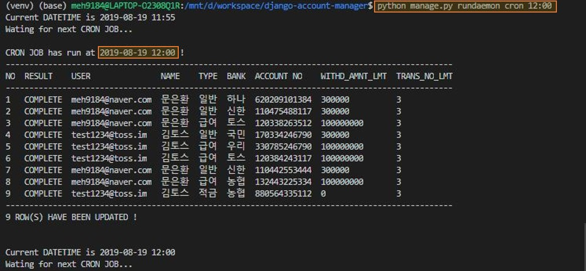

# django-account-manager

#### 계좌관리 및 거래 시뮬레이션 웹 어플리케이션

<kbd>
  
</kbd>

<br>
<br>

## *Introduction*

### Summary

> - Project 소개
>
>   - 계좌관리 및 거래 시뮬레이션 웹 어플리케이션입니다.
>
>   - 사용자당 최대 5개의 계좌를 계설할 수 있으며, 주 계좌를 설정/변경할 수 있습니다.
>
>   - 계좌의 종류는 총 3가지 (일반/급여/적금) 존재하며, 각각의 종류마다 출금 한도가 존재합니다. 
>
>   - 입금 한도는 없으며, 출금 한도는 다음과 같습니다.
>
>     - 일반 : 1회 30만원 / 1일 30만원
>
>     - 급여: 1회 1,000만원 / 1일 1억원
>
>     - 적금: 출금 불가
>
>   - 계좌간 이체가 가능하며, 종류가 다른 계좌로의 이체시 수수료 500원이 부과됩니다. 
>
>   - 다른 종류의 계좌로 이체시 하루 3건까지는 수수료가 면제됩니다.
>
> <br>
>
> - BACKEND (Djagno)
>
>   - Django를 이용하여 구현
>
> <br>
> 
> - FRONTEND (Djagno Template)
>
>   - Server-side templating engine인 Django Template을 이용하여 구현
>
> <br>
> 
> - DB (SQLite3)
>
>   - SQLite3를 이용 (DB 세팅 과정 생략하기 위해)
>

### Requirements

> - BACKEND/FRONTEND (Djagno/Django Template)
>
>   - [Python 3.6](https://www.python.org/downloads/release/python-360/)
>
>   - [Django 2.2.4](https://docs.djangoproject.com/en/2.2/releases/2.2.4/)
> 

### DataBase Models and Relations
> 
> **Database schema**
>
> 
> 
> 1. 하나의 사용자(User) 모델은 다수의 계좌(Account) 모델을 가질 수 있다.
> 
> 2. 하나의 계좌(Account) 모델은 다수의 입금(Deposit) 모델을 가질 수 있다.
> 
> 3. 하나의 계좌(Account) 모델은 다수의 출금(Withdraw) 모델을 가질 수 있다.
> 
> 4. 하나의 계좌(Account) 모델은 다수의 이체(Transfer) 모델을 가질 수 있다.
>

<br>
<br>

## *Installation*

### Clone project
> 
> - Github repository를 clone
>   ```bash
>   $ git clone https://github.com/meh9184/django-account-manager.git
>   ```

### Install dependencies
>
> - virtaulenv 설치 안됐다면 apt-get으로 설치하고,
> - virtaulenv 명령어로 현재 디렉터리에 가상환경 `venv` 생성 및 활성화
> - Python 버전은 3.6
>   ```bash
>   $ sudo apt-get install virtualenv
>   $ virtualenv --python=python3.6 venv
>   $ source venv/bin/activate
>   ```
>
> - 현재 가상 환경에 requirements.txt의 dependencies 설치
>   ```bash
>   $ pip install -r requirements.txt
>   ```
>

### Run server and daemon
>
> - Dependency가 설치됐으면 서버 실행
>   ```bash
>   $ python manage.py runserver
>   ```
> 
> - 하루 출금 한도 및 수수료 면제 이체 횟수 초기화 작업 위해 Background Daemon을 실행해야 함
> - 새로운 bash 쉘을 열어 가상 환경 venv 실행
>   ```bash
>   $ source venv/bin/activate
>   ```
> 
> - 가상환경 위에서 장고 Custom Command인 python mange.py rundaemon을 실행
> - 매일 자정(12:00 PM)에 초기화 작업을 수행하고 싶다면 다음과 같이 입력
>   ```bash
>   $ python manage.py rundaemon cron 00:00
>   ```
>
> - 초기 시뮬레이션 DB에서 생성한 테스트 User의 ID와 PW
> 
>   | Test User |  ID |  PW |
>   | --- | --- | --- |
>   | 1 | meh9184@naver.com |*test0000|
>   | 2 | test1234@toss.im |*test0000|
>
> - 웹 브라우저로 접속하고, 해당 아이디로 로그인하여 시뮬레이션 데이터 확인
>   - [http://localhost:8000/](http://localhost:8000/)
>

### Daemon Usage
>
> - Daemon은 Django Custom Command를 통해 구현
>
> - 리눅스의 crontab 명령어를 모방 (시간 입력 포맷은 다르게 구현)
>
> - **daemon 사용법**
> 
>     1. Interval 옵션
>
>         - 현재 시간으로부터 특정 기간(분 단위)이 지나면 리셋 작업을 실행
>
>         - interval 옵션과, 리셋할 간격(분 단위)을 파라미터로 입력
>
>         - <EX1> 현재 시간으로부터 5분이 지날 때 마다 리셋 작업 실행
>
>             ```bash
>             $python manage.py ruundaemon interval 5
>             ```
>             
>
>         - <EX2> 현재 시간으로부터 30분이 지날 때 마다 리셋 작업 실행
>             ```bash
>             $python manage.py ruundaemon cron 30
>             ```
>             
>
>     2. Cron 옵션
>
>         - 특정 시간(분 단위)에 리셋 작업을 실행 
>
>         - cron 옵션과, 리셋할 시간(시간:분 포맷)을 파라미터로 입력
>
>         - <EX1> 매일 오전 11시 33분 마다 리셋 작업 실행
>
>             ```bash
>             $python manage.py ruundaemon cron 11:53
>             ```
>             
> 
>         - <EX2> 매일 정오(낮 12시 00분) 마다 리셋 작업 실행
>             ```bash
>             $python manage.py ruundaemon cron 12:00
>             ```
>             
> 

### To start clean db status
>
> - [Report implemented assignment](#report-implemented-assignment) 파트에서 설명하는 시뮬레이션 데이터를 그대로 이어받도록 `db.sqlite3` 파일을 같이 push해 두었습니다.
> 
> - 만약, Clean한 상태로 프로젝트를 시작하고 싶다면 다음과 같이 수행해주세요.
> 
> - `db.sqlite3` 파일을 삭제
>   ```bash
>   $ rm db.sqlite3
>   ```
> 
> - makemigrations / migrate 명령을 통해 DB 생성
>   ```bash
>   $ python manage.py makemigrations
>   $ python manage.py migrate
>   ```
> 
> - migrate 작업 완료됐으면 서버 실행
>   ```bash
>   $ python manage.py runserver
>   ```
>
> - 새로운 쉘을 열어 데몬 프로세스 실행 (리셋 시점은 매일 자정으로 설정)
>   ```bash
>   $ python manage.py rundaemon cron 00:00
>   ```
>

<br>
<br>

## *Report implemented assignment*

- 구현한 `기능` 및 `제약사항`들을 케이스별로 시뮬레이션하며 설명드리겠습니다.
- 모든 케이스들은 순차적으로 진행되며, 해당 시뮬레이션 DB는 db.sqlite3 에 저장되어 있습니다.
- 시뮬레이션 및 기능 설명 순서는 다음과 같습니다.

> 1. [회원 가입 / 로그인](#회원-가입--로그인)
> 2. [계좌 개설](#계좌-개설)
> 3. [주 계좌 변경](#주-계좌-변경)
> 4. [거래](#거래)
>     1. 입금 (Deposit)
>     2. 출금 (Withdraw)
>     3. 이체 (Transfer) - 자신의 계좌에 송금
>     4. 이체 (Transfer) - 타 새용자 계좌에 송금
> 5. [제약 사항](#제약-사항)
>     1. 계좌 개수 한도
>     2. 출금 한도
>     3. 이체 수수료
> 6. [내역 조회](#내역-조회)
>     1. 특정 계좌 거래 내역 조회
>     2. 모든 계좌 거래 내역 조회
>     3. 타임라인


### 회원 가입 / 로그인
> 
> 
> 
> - Django 프레임워크의 django.contrib.auth.model 을 사용하여 CustomUser 모델을 생성했으며
> 
> - Django 프레임워크의 django.contrib.auth.forms 를 사용하여 회원가입/로그인 Form을 구현
> 
> - main 페이지의 `로그인` / `회원가입` 버튼을 클릭하여 수행

### 계좌 개설
>
> 
> 
> - 로그인후 우측 상단의 `계좌 생성` 버튼을 클릭하여 새로운 계정 생성
> 
> - 은행, 계좌번호, 계좌 형태, 초기 잔액, 주 계좌 여부를 입력하고 계정 생성

### 주 계좌 변경
>
> 
> 
> - 주 계좌를 변경하기 위해 우측 상단의 `주 계좌 변경` 버튼 또는 현재 주 계좌의 `주 계좌` 버튼을 클릭
> 
> - 변경하고자 하는 계좌 하단의 `주 계좌로 선택` 버튼 또는 `은행 명` 클릭하여 변경

### 거래
>
> **입금 (Deposit)**
>
> 
> 
> - 메인 페이지에서 입금 하고싶은 계좌 우측 하단의 `입금` 버튼 클릭
> 
> - 입금하고자 하는 금액 입력한 후 `Submit` 버튼 클릭
> 
> - 계좌의 잔액이 추가되고, 최근 거래 목록에 입금 기록이 생겼는지 확인
>
> <br>
> 
> **출금 (Withdraw)**
>
> 
> 
> - 메인 페이지에서 출금 하고싶은 계좌 우측 하단의 `출금` 버튼 클릭
> 
> - 출금하고자 하는 금액 입력한 후 `Submit` 버튼 클릭
> 
> - 계좌의 잔액이 감소되고, 최근 거래 목록에 출금 기록이 생겼는지 확인
>
> <br>
> 
> **이체 (Transfer) - 자신의 계좌에 송금**
>
> 
> 
> - 메인 페이지에서 이체 하고싶은 계좌 우측 하단의 `이체` 버튼 클릭
> 
> - 이체하고자 하는 계좌 정보와 금액 입력한 후 `Submit` 버튼 클릭
> 
> - 출금/입금 계좌의 잔액 변화와, 최근 거래 목록에 이체 기록이 생겼는지 확인
>
> <br>
> 
> **이체 (Transfer) - 타 새용자 계좌에 송금**
>
> 
> 
> - 메인 페이지에서 이체 하고싶은 계좌 우측 하단의 `이체` 버튼 클릭
> 
> - 이체하고자 하는 계좌 정보와 금액 입력한 후 `Submit` 버튼 클릭
> 
> - 이체를 보낸 계좌의 잔액 감소와, 최근 거래 목록에 이체 기록이 생겼는지 확인
>
> - 로그아웃 -> 타 사용자 로그인 후
>
> - 이체 받은 계좌의 잔액 증가와, 최근 거래 목록에 이체 기록이 생겼는지 확인

### 제약 사항
>
> **계좌 개수 한도**
>
> 
> 
> - 계좌는 사용자당 최대 5개씩만 개설 가능
>
> - `계좌 생성` 작업을 통해 계좌를 5개 이상으로 생성 시도
> 
> - 6번째 계좌 생성시 생성된 에러 메시지 확인
>
> <br>
> 
> **출금 한도**
>
> 
> 
> - 출금은 계좌의 종류에 따라 한도가 설정되어 있으며, 한도 초과시 출금버튼 비활성 (서버에서도 거부)
>
> - 출금할 계좌의 `은행 이름` 버튼 클릭하여 상세정보 들어가서, `하루 출금 허용 잔여 금액` 확인
>
> - `하루 출금 허용 잔여 금액`만큼 출금한 후, 출금 버튼 비활성화 되는지 확인
> 
> - 해당 계좌의 상세정보 다시 들어가서, `하루 출금 허용 잔여 금액` 0 됐는지 확인
> 
> <br>
> 
> **이체 수수료**
>
> 
> 
> - 이체는 서로 다른 은행의 계좌라면 3회까지 무료이며, 이후 부터는 500씩 수수료 부과
> 
> - 이체할 계좌의 `은행 이름` 버튼 클릭하여 상세정보 들어가서, `하루 무료 계좌이체 잔여 횟수` 확인
> 
> - `하루 출금 허용 잔여 금액`만큼 이체한 후, 이체 버튼의 색깔이 변하는지 확인
> 
> - 해당 계좌의 상세정보 다시 들어가서, `하루 무료 계좌이체 잔여 횟수` 0 됐는지 확인
>
> - 이후 다른 종류의 계좌이체에서 수수료 500원이 붙는지 확인

### 내역 조회
>
> **특정 계좌 거래 내역 조회**
>
> 
> 
> - 거래 내역을 확인하고 싶은 계좌의 `내역 조회` 버튼을 클릭하여 입금, 출금, 이체 내역 확인
> 
> - 해당 계좌의 내역이 최근 순으로 조회 되는지 확인
> 
> <br>
> 
> **모든 계좌 거래 내역 조회**
>
> 
> 
> - 우측 상단의 `조회` 버튼을 클릭하여 사용자가 소지하고 있는 모든 계좌들의 내역 확인
> 
> - 모든 계좌들의 내역이 최근 순으로 조회 되는지 확인
> 
> <br>
> 
> **타임라인**
>
> 
> 
> - 우측 상단의 `타임라인` 버튼을 클릭하여 하루 단위로 분리 돼있는 거래 내역 확인
>
> - 해당 페이지에서 각 계좌의 `은행 명` 버튼 클릭시 해당 계좌의 상세정보 페이지로 이동

<br>
<br>

## *Addition Commentary*

### VCS
> 
> - 각 기능별 개발이 완료될 때 마다 적절히 git commit / push / pull 사용하며 진행했습니다.
> 
> - Github 저장소의 [Issue 등록 페이지](https://github.com/meh9184/django-account-manager/issues?q=is%3Aissue+is%3Aclosed)를 활용하여 개발 필요한 기능 정리해두고, 개발 완료시 close 하며 진행했습니다.
> 
> - 생성한 Issue 단위로 branch 생성하여 개발했고, 개발 완료시 master에서 merge 하며 진행했습니다.
> 

### Issues
> 
> - 하루 출금 한도 및 수수료 면제 이체 횟수 초기화 이슈
>
>     1. django-background-tasks 모듈을 통해 이체 무료 횟수 및 출금 한도량을 초기화 하고자 했습니다.
>
>         - 문제 : bach 실행 타이밍이 정확하게 맞아 떨어지지 않는 이슈가 발생했습니다.
>
>         - 원인 : 개발자 커뮤니티를 통해 WSL환경에서의 모듈 버그인 것으로 추정되었습니다.
>
>         - 방안 : 리눅스의 crontab 명령어를 사용하는 django-cronta 모듈을 사용해보기로 했습니다.
> 
>     2. django-crontab 모듈을 이용하여 Crontab JOB을 생성하도록 시도했습니다.
>
>         - 문제 : Crontab 명령어가 작동하지 않는 이슈가 발생했습니다.
>
>         - 원인 : 개발자 커뮤니티를 찾아본 결과 django-crontab 모듈은 리눅스의 crontab 명령어를 사용하며, 윈도우 위에 리눅스 binary를 올린 형태의 WSL 환경에서는 crontab 명령어 자체가 적용되지 않는다는 것을 확인했습니다.
> 
>         - 방안 : 직접 백그라운드 데몬 프로그램을 만들기로 했습니다.
> 
>     3. Python의 threading 모듈을 이용하여 백그라운드 프로세스를 가동시켜 DB를 컨트롤 했습니다
>
>         - 문제 : Django 프로젝트와 독립적인 스크립트에서는 DB에 접근할 수 없는 문제가 발생했습니다.
>
>         - 해결 : Django Custom Command를 만들어, 그 안에서 threading 모듈을 실행했습니다.
>
>         - 결과 : Cron 및 Interval 옵션을 통하여 원하는 시점에 리셋 작업을 Call할 수 있었습니다.
> 
> - API timeout 및 질의 최적화 관련 작업
> 
>     - 주어진 시간 안에 진행하지 못했습니다.
> 


### Tools for Windows OS Users
> - [WSL (Windows Subsystem for Linux)](https://docs.microsoft.com/ko-kr/windows/wsl/install-win10)
> - [VSCode](https://code.visualstudio.com/docs/?dv=win)
> - [Github](https://github.com/meh9184/django-account-manager/)
> 

### References
> 
> - https://docs.djangoproject.com/ko/2.2/
> - https://docs.microsoft.com/ko-kr/windows/wsl/install-win10
>
